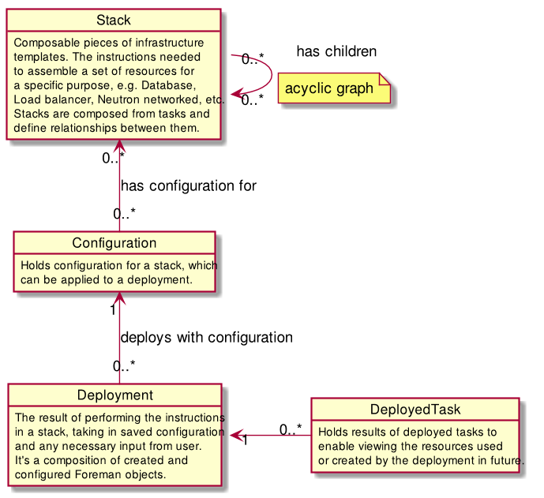

# Design


This design document describes the concept of multi-host orchestration in the Foreman.


## Goals
* allow for defining multi-host provisioning, configuration and orchestration
* instance independent deployment definition
* sharing the definitions
* pre-configured "one click" deployments



## Stack

*Stack* is an abstract representation of the multi-host infrastructure to be built. They are composed of multiple *tasks* dependent on each other and define
relationships between them. Example tasks are "create host", "create hostgroup", "provision host", "run puppet", etc. See the "Tasks" section below
for the detailed definition of the term.

*Stacks* are designed to be independent of the Foreman instances and therefore they allow for being shared. The ultimate goal is being able to import a stack that
has been created elswhere into your Foreman instance and deploy it on our infrastructure. User inputs and mapping to the Foreman objects take place
in the configuration phase of the deployment. All inputs are defined by the *tasks*.

Same as majority of entities in the Foreman, stacks can be available to multiple organizations and locations.


## Tasks

Tasks are the units a stack is composed of. Each task has defined input parameters and results that it produces. Result of one task can be used as an input
of another one, which enables for setting dependencies.

The stack definition gives a name and description for each of the task instances, to make it more clear what's its purpose. This information will be reused
in user interface for configuring deployments.

**Example:**

A task for creating subnets accepts input parameters
- name
- network_address
- network_mask
- ...

and produces a subnet instance

See [list of tasks](tasks.md) for details about planned tasks.


## Stack definition

The stack defines tasks to be used, their inputs and relationships. Task's input can be:
* hardcoded value
* input required form a user in the configuration phase (will allow for basic type validations)
* reference to a value from another task
* ignored (default value is used)

Stacks are defined in yaml files.

```yaml
DbServerHostgroup: !!createResource
  resource: 'Hostgroup'
  parameters:
    name: 'DB servers'

DbHost: !!createResource
  resource: 'Host'
  description: 'Database hosts'
  count: !!input
    data_type: 'int'
    min: '1'
  parameters:
    name: !!template
      value: 'db-%'
    puppet_classes:
      - ntp
      - postgres
    comment: 'Database server'
    hostgroup: !!reference
      object: 'DbServerHostgroup'
      field: 'result'
```


#### Ordering actions without direct dependency

Each task has input field `after`, which can be used for forcing the order.

```yaml
FirstRun: !!puppetRun

SecondRun: !!puppetRun
  after: !!reference
    object: 'FirstRun'
    field: 'result'
```


#### Stack's lifecycle

1. Stacks are created as yaml descriptions of the infrastructure. Such yaml file is imported into the Foreman either via UI or API.
   Yaml is the only supported import format. We can create conversion tools from a dedicated DSL to the yaml for the users' convenience
1. Modification of imported stacks is not enabled. If the yaml definition is changed, users must import it again as a new stack.
1. Stacks can be deleted only when there's no existing deployment of them. The removal action deletes the stack, it's resource definition and configurations.


## Deployment

A *deployment* is a result of performing the instructions in a *stack*. It is an instance of a *stack*.

Similar to hosts, deployments belong to a single organization and location.

#### Deployment's lifecycle

1. A deployment is created as a named instance of a stack.
2. Before the deployment can be deployed, it needs to be configured. Users fill missing parameters in this step and assign Foreman's resources like hostgroups and subnets.
More on this step later.
3. A configured deployment can be deployed onto the Foreman's infrastructure. This step is handled by dynflow.
4. A deployment record(s) can be deleted while the deployed hosts keep on running. Although they save links to Foreman objects, deployments are separate from them.
Deleting associated hosts and hostgroups together with the deployment can be added as a future feature.


## Deployment configuration

Deployment configuration holds set of user's inputs and mapping on the Foreman instance's objects. For example
what parent usergroups should be used, mapping of subnets, number of hosts and their network interfaces.

Configuration is always instance specific. It is kept separate from the deployments to enable saving pre-configurations and cloning of existing deployments.

Pre-configurations are saved without foregin key to any deployment. Users can clone and create a new deployment based on the saved config.
Unclonable fields like mac addresses are blanked and users need to replace them with new values. In certain circumstances this enables one click deployments.

The saved configuration consists of pieces belonging to individual resources. Each piece is saved into DB as an exported json. Resources
provide classes responsible for interpreting and saving the config.


## Extensibility

Deployments will be extensible via foreman plugins that can define their own tasks, add properties to existing tasks and define additional input validators.

Tasks don't need to be limited to the Foreman only. In future the system can be extended with tasks for email notifications,
approvals, integration of third-party sytems (e.g. REST calls), etc.


### Integration with Katello

We will integrate with Katello the same way. In the first phase we count with defining fields for an activation key
on tasks for creating `Hosts` and `Hostgroups`. It will also be possible to select resources from Katello.


### Integration with Discovery

We plan two usecases:

1. using already discovered host when you start a deployment manually

The configuration of a host selection task should enable you choosing discovered hosts to be used in the deployment alongside with managed hosts.
The stack description should not care about where the host comes from (whether it's discovered, existing to be re-provisioned or a newly created one).

2. automatic deployment on discovered hosts

Discovery already has a feature called [automatic provisioning](http://theforeman.org/plugins/foreman_discovery/3.0/index.html#4.3Automaticprovisioning)
that allows for setting rules for matching discovered hosts, assigning them to a hostgroup automatically and start their provisioning once they're discovered.
This mechanism should be extended to enable assigning hosts to a deployment (and it's tasks for selecting hosts) and running it when there's enough of them.


## The basic deployment workflow
1. stack definition
  * the user writes the yaml definition and imports it into the foreman → new stack is created
2. stack import
  * check it is valid yaml
  * check all the used tasks are present in foreman
  * save it
3. deployment creation
  * user selects the stack to deploy and gives the deployment a name
  * user optionaly selects an existing (pre)configuration of the stack
  * clone the configuration or create a new one
4. deployment configuration
  * parse the stack and get list of tasks
  * apply the (pre)configuration and get fields that need input
  * the task inputs are presented in their order
  * take a value for an input, validate it, save it if it's correct
  * check if all required fields are configured
5. deploying the deployment
  * take configuration
  * execute pre-run validation for each task
    - can test for example if required puppet classes are present
    - tests whether selected record ids still exist (could be deleted since the configuration had been saved)
  * parse the stack and get list of tasks
  * plan dynflow actions with the values from above ^
    - one main action that takes stack and configuration
    - merge configuration for the task with values hardcoded in the stack definition
    - plan the tasks with their configuration hashes
  * execute the main task


## Editing deployed infrastructure

Editing a deployed infrastructure (e.g. adding more hosts or removing some) is a complex task that can't be done automatically in most cases.
Users will need to define an extra stack for that process and run it separately.


## Compatibility issues

Some stacks might not be applicable to all operating systems, for example because of incompatibility of the used puppet classes.
We will solve this by description of the stack (descriptions are shown to user during deployment configuration and creation).

There are no plans to implement any kind of such compatibility checks in the first phase. We can later implement it via better validations
for user input's.


## Future features

Features that won't be part of the first implementation but can be added later to extend the design.

#### Composed stacks

Apart from defining usual tasks, a stack can define usage of another existing stack. User can for example define a "Web app stack" that is composed of a "Database stack" and a "Web server stack".

#### Stack abstraction

It is possible to define an abstract stack that can't be deployed. Such stacks require their concrete implementations, that fulfill [The Liskov substitution principle](http://en.wikipedia.org/wiki/Liskov_substitution_principle).

E.g. a "Web app stack" could be defined as composition of "Abstract DB stack" and "Abstract server stack". This needs to be substituted by concrete implementations (e.g. "Sinatra stack" and "Mongo DB stack") upon a deployment creation.

#### Stack inheritance

Stacks can inherit properties from their parents. All parent resources and their associations are then also part of child stacks. Child stack can add new resources, but no updates or removals are allowed. Child resource may depend on resource from parent stack.

Example use case can be abstract DB stack and its implementations where inheritance makes the implementation easier.
