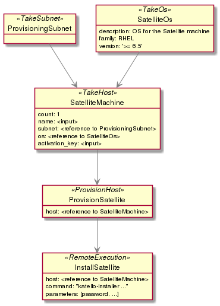
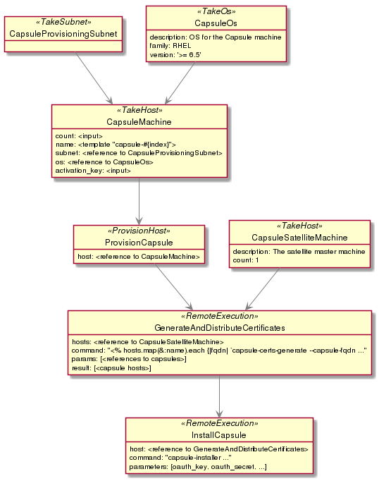
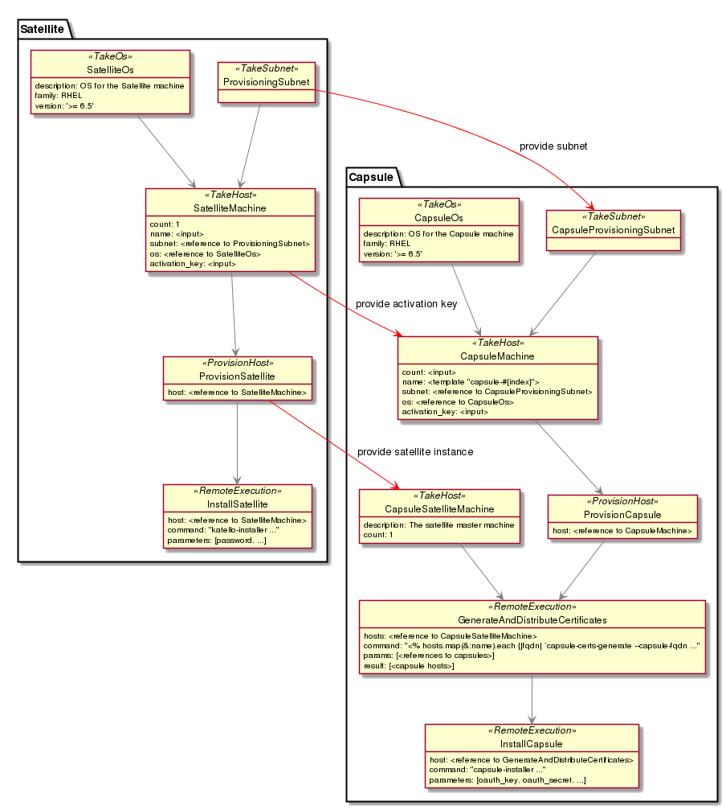

# Examples and usecases


## Satellite 6 master and capsule installation

Deploy one Satellite 6 instance with N capsules.

The whole deployment can be split to 3 subproblems:

1. provision and configure Satellite 6 machine
2. provision and configure capsules
3. pair them together


## Satellite 6

1. provision the machine
2. get content & install Satellite 6




[svg version of the diagram](diagrams/sat_stack.svg) for better readability


#### Stack definition
```yaml
ProvisioningSubnet: !!selectResource
  resource: 'Subnet'
  description: Subnet to provision the Satellite on

SatelliteOs: !!selectResource
  resource: 'Os'
  description: OS for the Satellite machine
  constraints:
    family: RHEL
    version: '>= 6.5'

SatelliteMachine: !!createOrSelectResource
  resource: Host
  description: The satellite machine
  count: 1 # default value
  parameters:
    name: !!input
      data_type: string
    interfaces:
      - primary: true
        subnet: !!reference
          object: 'ProvisioningSubnet'
          field: 'result.subnet'
    os: !!reference
      object: 'SatelliteOs'
      field: 'result.os'
    activation_key: !!select
      resource: 'ActivationKey'

ProvisionSatellite: !!provisionHost
  hosts: !!reference
    object: 'SatelliteMachine'
    field: 'result.hosts'

InstallSatellite: !!remoteExecution
  hosts: !!reference
    object: 'SatelliteMachine'
    field: 'result.hosts'
  command: 'katello-installer ...'
  parameters:
    password: !!input
      data_type: string
```


## Capsule

1. provision the machine
2. generate certificates on the Satellite machine
3. transport the certs to the Capsule machine
4. get content & install Capsule (requires the certs and oauth credentials)




[svg version of the diagram](diagrams/capsule_stack.svg) for better readability


#### Stack definition
```yaml
ProvisioningSubnet: !!selectResource
  resource: Subnet
  description: Subnet to provision the Capsules on

CapsuleOs: !!selectResource
  resource: Os
  description: OS for the Capsule machine
  constraints:
    family: RHEL
    version: '>= 6.5'

CapsuleMachine: !!createOrSelectResource
  description: The capsule machine
  resource: Host
  count: !!input
    data_type: integer
    validate: '> 0'
  parameters:
    name: !!template
      template: 'capsule-{index}'
    interfaces:
      - primary: true
        subnet: !!reference
          object: 'ProvisioningSubnet'
          field: 'result.subnet'
    os: !!reference
      object: 'CapsuleOs'
      field: 'result.os'
    activation_key: !!select
      resource: 'ActivationKey'

ProvisionCapsule: !!provisionHost
  hosts: !!reference
    object: 'CapsuleMachine'
    field: 'result.hosts'

SatelliteMachine: !!selectResource
  description: The satellite master machine
  resource: Host
  count: 1

GenerateAndDistributeCertificates: !!remoteExecution
  hosts: !!reference
    object: 'SatelliteMachine'
    field: 'result.hosts'
  command: \"<% hosts.map(&:name).each {|fqdn| `capsule-certs-generate --capsule-fqdn ...\"
  params:
    capsules: !!reference
      object: ProvisionCapsule
      field: result.hosts
  result:
    hosts: '<% hosts %>'

InstallCapsule: !!remoteExecution
  hosts: !!reference
    object: 'GenerateAndDistributeCertificates'
    field: 'result.hosts'
  command: 'capsule-installer ...'
  parameters:
    oauth_key: !!input
      type: string
    oauth_secret: !!input
      type: string
```


## Coupling Satellite and Capsule stacks

Encapsulating stack will update the substack tasks to:
- use the same subnet
- capsule should be registered against the satellite
- use the same activation key

This feature will be available in future versions. In the first release one will need to describe both processes in one stack.



[svg version of the diagram](diagrams/complete_stack.svg) for better readability


#### Stack definition
```yaml
SatelliteStack: !!stack
  name: Satellite

CapsuleStack: !!stack
  name: Capsule

CapsuleStack:SatelliteMachine: !!override
  activation_key: !!reference
    object: 'SatelliteStack:SatelliteMachine'
    value: 'result.host.activation_key'

CapsuleStack:ProvisioningSubnet: !!override
  subnet: !!reference
    object: 'SatelliteStack:ProvisioningSubnet'
    value: 'result.subnet'

CapsuleStack:SatelliteMachine: !!override
  host: !!reference
    object: 'SatelliteStack:ProvisionSatellite'
    value: 'result.host'
```

More capsules can be added later by running the Capsule stack again
