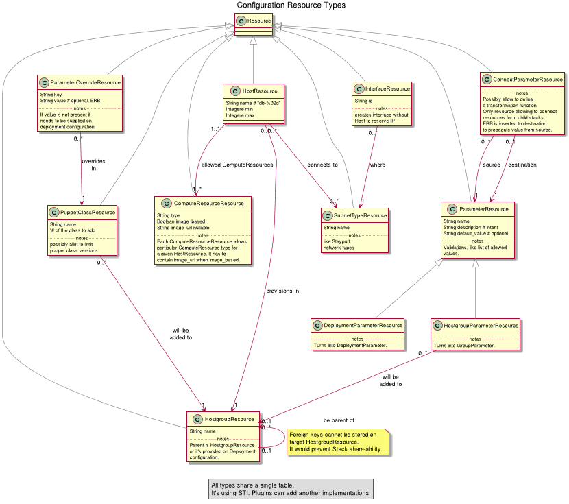
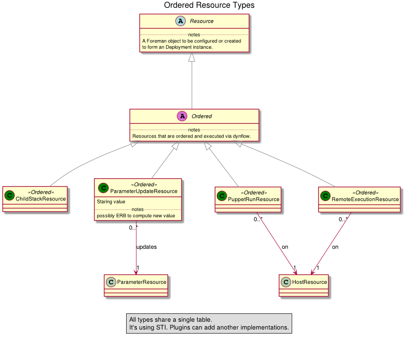

## Configuration resources

[SVG version of the diagram for better readability](./diagrams/config_resource_overview.svg)

#### Host
Define host roles, for example "Database" or "Proxy".

* enables to specify a range for the number of hosts of such type
* each host is required to be in a hostgroup
* hosts are named "#{name}-#{index}", hosts created without provisioning keep their original name
* relationships:
  * belongs to `hostgroup resource` - each host needs to be in a hostgroup, deployment always creates a new one
  * has many `puppet_run resources`, `subnet_type resources`
* user input:
  * number of such hosts from the range
  * selecting existing hosts or compute resource and it's parameters
  * networking setup for the hosts
  * whether to provision the host or not

#### Hostgroup
Defines hostgroup that will be created and used internally for organizing the hosts in a deployment.

* users can select a parent hostgroup to inject OS settings, puppet proxies and others
* parents can be defined also in the stack as another hostgroup resource
* relationships:
  * belongs to `hostgroup resource` - for means of the hostgroup's resource inheritance
  * has many `parameter resources`, `host resources`, `puppetclass resources`
* user input:
  * parent hostgroup

#### SubnetType
Declares what subnet types are used in the stack, for example "Public API subnet" and "Provisioning subnet". There will always be at least one subnet type for the provisioning purposes. Host resource selects what subnet types it uses. Hosts are required to have one NIC per subnet type.

* relationships:
  * has many `host resources`
* user input:
  * select subnet from the foreman

#### Interface
Dummy interface that is not assigned to any host. It's purpose is to reserve address from the subnet's range.

* relationships:
  * belongs to `subnet_type resource`

**FUTURE FEATURE**: *it might be interesting to define interfaces requirements on hosts too, e.g. HA deployment requires bond of 2 physical interfaces*

#### HostgroupParameter
Stack's input parameters that are set on a hostgroup. They allow using erb snippets in the value as usual parameters in the Foreman do.
They are one of the main entry points for user's input. When configured they set global parameter for the hostgroup.

* parameters can have default value
* if the parameter is already set in the parent, we ignore setting it (requires explicit 'inherit' value on parameter)
* they bear a flag telling if it should be or shouldn't be configured by users

* relationships:
  * belongs to `hostgroup resource`
* user input:
  * parameter value

#### StackParameter (nice to have, future feature)
Global parameters for the whole stack (having the same features as `HostgroupParameter`s). When configured they are copied to all hostgroups as global parameters
unless the hostgroup already defines such parameter.

* user input:
  * parameter value

#### PuppetClass
Puppet classes to be assigned to a hostgroup. It is user's esponsibility to make sure the class is present in the selected environment. We will validate their presence
in the `before_deployment_validation`. The resource contains meta-parameters with the link to sources and version to point where the class comes from when it's missing.

* relationships:
  * belongs to `hostgroup resource`
* user input:
  * NONE

#### PuppetClassOverride
Allows setting override values for a puppet class on a hostgroup.

* relationships:
  * belongs to `puppet class resource`
* user input:
  * NONE

#### ComputeResourceType
Puts restriction on where the host can be deployed and what are the minimal requirements. For example we can require a specific image for EC2 compute-resource.

* relationships:
  * belongs to `hostgroup resource`
* user input:
  * NONE

#### ConnectParameter
ConnectParameter simplifies connecting parameters from parent and child stacks. It only propagates value from a parameter to a parameter of the child stack.

## Ordered resources

[SVG version of the diagram for better readability](./diagrams/ordered_resource_overview.svg)

#### PuppetRun
Triggers a puppetrun on a host.

* relationships:
  * belongs to `host resource`
* user input:
  * NONE

#### ParameterUpdate
Updates a parameter on a hostgroup.

* relationships:
  * belongs to `parameter resource`
* user input:
  * NONE

#### ChildStack
Executes another stack.

* user input:
  * NONE

#### RemoteExecution
Execute custom code on a host.

* relationships:
  * belongs to `host resource`
* user input:
  * NONE

